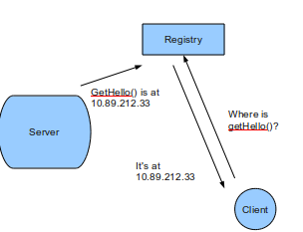
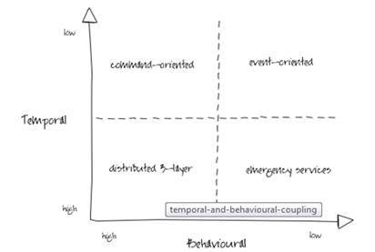
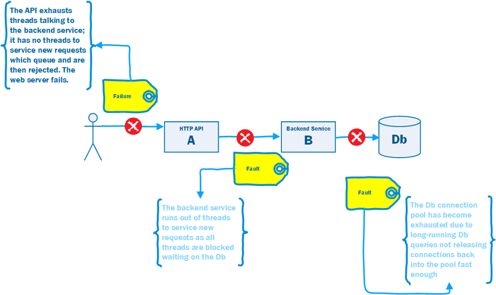
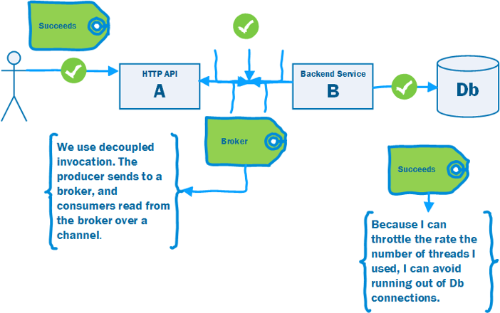
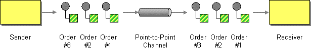
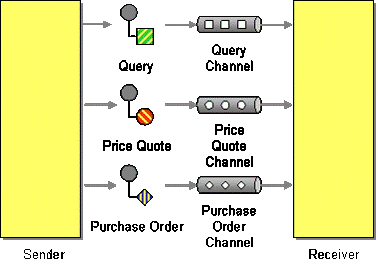
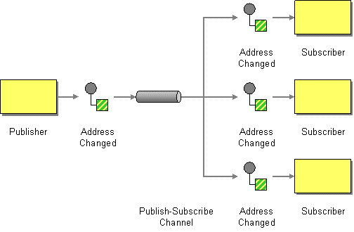
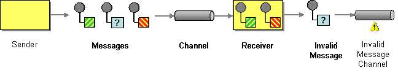
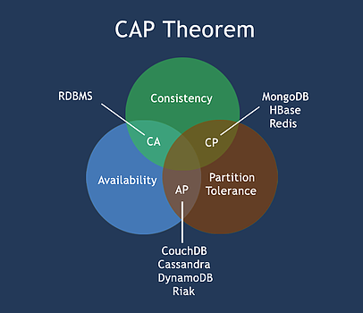

# Ndc 2019 - Practical messaging (Ian cooper - @ICooper)

A tutorial for teaching basic messaging patterns

# Day #1

## Ian Cooper presentation

## History of communication

COM, SOAP, ESB, REST, micro services (throwable SOA (original) - Fred George, actual SOA - James lewis), ...

## Brighter

https://www.goparamore.io/

 

## Book

Enterprise integration pattern

 

## Github

https://github.com/iancooper/Practical-Messaging-Sharp

## Distributed systems

### Performance and Scalability

### Availability

### Maintainability

### Inherent distribution

## Integration vs Distribution

An n tier system is **distributed** but **not integrated**

A distributed system tends to use synchronous communication because the parts are not independent

An integrated system can often use asynchronous communication because the applications are independant

## LOLs

### The network is reliable ;)

### Latency is zero ;)

### Bandwidth is infinite ;)

### The network is secure ;)

### Topology doesn't change ;)

### There is non administrator ;)

### Transport cost is zero ;)

### The network is homogeneous ;)

## Any two applications are different

## Change is inevitable

# Building distributed Systems

## Integration styles

### File transfer

Two processes communicate via the producer writing to a file, and the consumer reading from it

A common data transfer mechanism that can be used by a variety of languages and platforms and feels neutral towards each

Requires agreement; file names, locations, who manage files...

Will create eventual consistency between systems due to periodic nature of publication

### Shared database

Two processes communicate by the producer writing to a databse and the concumer reading from it

Creating a unified schema that can meet the needs of all applications is a challenge

Breaks encapsulation and causes change to ripple across all applications

Often the Db supporting many enterprise-wide apps becomes the bottleneck

### Remote Procedure Call

Two processes communicate by the client causing a procedure to exectue in another address space belonging to the server, coded as if it were a local function

Integrates functionality, not data

Behavioral coupling can tie the systems together in a knot, particalarly in sequencing ...

### Messaging

Two processes communicate by the producer sending a packet of data to a channel and the sender reading that packet of data from the channel

Async communication does not require bot systems to be up and ready at the same time

Messages can be transformed in transit without sender or receiver knowing

Small messages frequently allows behavioral as well as data collaboration   

## What is RPC (messaging's best rival)

James White 1976 (RFC 707) - "A High-Level Framework for Network-Based Resource Sharing” describes Remote Procedure Calls (RPC).

White identified that many of the protocols in use for inter-process comm (IPC) such as file transfer protocol (FTP), or Remote Job Execution (RJE) had a common: Command-Response pattern.

> command-name <SP> parameter <CRLF>
>
> response-number <SP> text <CRLF>

The key priciple is that a remote procedure call should be as close as possible to local (single machine) procedure calls

A client should not know the location of the server (location transparency)

### Interface definition language (IDL)

RPC frameworks use these modules to generate stubs for the caller and the receivcer

### Service registration and discovery

If the call looks like a local procedure call, how do we know where the server is that will service the request?

You need to register services via a distributed key-value store.

The server runtime exports its interface names, along with server name and network location. i.e. service registration

A client requests from the runtime servers that provide the interface and then routes the request (in this case to the closest) i.e. service discovery

### Problems

/!\ Blocking & what happens if the work failed ?!? Waiting ?!?

## What is messaging ?

High-speed, asynchronous, interprocess communication with reliable delivery

Processes communicate by sending packets of data called messages

Channels are logical pathways between processes

A message is a datastructure

Messaging depends on Message Oriented Middleware (MOM)

- Routes messages between applications
- Co-ordinates sending and receiving of messages
- Sender and receiver have the same availability
- Asynchronous: Send and Forget 
- Store and Forward

## Prefer messaging

Without it we are reinventing the wheel in ad-hoc network programming

### RPC

- Location independence
- Platform coupling
- Temporal coupling
- Behavioral coupling
- Synchronous communication
- Data format
- Connection-oriented

### Messaging

For David Parnas, the criteria for decomposition is **information hiding**, not application flow

Good:
- Platform independent data format
- Sent to an addressable channel
- Support data transformations
- Remote communication
- Platform/Language integration
- Asynchronous Communication
- Throttling
- Reliable communication

 Bad:
 - Complex programming model (compensation...)
 - Sequencing
 - Eventual consistency
 - Many moving parts
 - Performance
 - Lock-In

Difference Command/Event

Command => Knowing of a system executing => expectation

 

Event => no expectation

 

### Messaging vs RPC

Loose coupling

RPC => much higher coupling

Do not send data to a specifinc machine (ip), but to an addressable channel

The channel should queue requests to remove temporal coupling

 

### Decoupled invocation pattern

A producer puts a message onto a queue. A consumer take the message hand consume it

### Work queue pattern

A common distributed system (as opposed to integrated system) pattern

Use deoupled invocation to put the work on a queue, offloading the long running tasks, allowing the web server to respond in time

If too long return 202 and provide location (URI) to monitor completion

## Fundamental messaging patterns

### Message construction

>Analogy:
>
>RPC => phone call
>
>Messaging => mail or email

- A message has a header and a body
- Message intent: Command, Document (contains data, not just an event), Event (just an tiny little event)
- Request-Reply: needs return channel and correlation identifier
- Break a large message into pieces as a message sequence
- Slow messages: one way to deal with eventual consistency is to create a message expiry

### Command Message

Use a command message to reliability invoke a procedure in another application => expectation

Uses the well-established pattern for encapsulating a request as an object

### Document message

Use Document message to reliably transfer a datastructure between applications

### Event message

No Business Data

### What about getting data

Where does a consumer of an event message get data it needs to process the message ?
1. Push model : the message is combined document/event message
2. Pull model : sequence
    - update
    - state request
    - state reply
3. Reference Data : Apps exchange out of band messages about operand/collection data? May be a document message, or File transfer etc. (like cache listening messages to stay up to date)

**RPC** : Command message-Document Message

**Query** : Command message- document message/sequence message

### Sequence message

Contains a message id a sequence part id

> **Message sequencing is not compatible with competing consumers** => only one consumer ! (if not partitioned)

### Useful message properties

Expiration

Format indicator : version ...

### Channels

A virtual pipe that connect producer and consumer

Messaging is not a 'bucket'. A consumer can filter according to the type of information it wants.

Logical address

Unidirectionnal

One-to-one or one-to-many

## Coding time

- Point to point

- Datatype channel

- Publish/Subscribe

- Invalid message / Deadletter

- Deadletter channel

... endpoint

### Messaging mapper

### Polling consumer

Consume every X times

Connection can be idle

Clients are using more CPU

Server is using more CPU

### Event Driven Consumer

Keep connections open

Less CPU on client side

More CPU on the server side

Availability to use back pressure and throttling

### Service Activator

Requestor / Replier (like MassTransit)

### Coding time : Polling consumer

# Day #2

## Competing consumers

We cannot process fast enough and we have high latency

Eventual consistency at high latency looks like network partition

A single consumer is bad - if it fails, that failure cascades to callers

Ordering ...

## Pipes and filters

### Coding time : Pipes and filters

### Coding time : Request / Reply   

### Parallel pipelines

### Routers

#### Content based router

Router decide which routee should receive the message according to the content

#### Dynamic router

Routees inform the router about what they should receive through a control channel

#### Splitter

Split a message into many and send each of them to a routee

Avoid big payload, store big content externally and pass reference if necessary (blob storage...)

#### Aggregator

inverse of a splitter => aggregate messages

Needs an internal buffer

#### Resequencer

Reorder correlated messages

#### Recipient list

Kinda like a pub sub but with multiple channels (like topics)

#### Routing slip

Route message according to Slip

Each message know its steps (sequence of routes)

#### Process manager

Use a central processing unit 

Define a workflow on a central point

Low testability

#### Message translator

#### Content enricher

#### Control bus

Can use heterogenous tech to implement control bus (monitoring for exemple)

#### Message store

#### Durable Subscriber

### Error handling strategies for coupled systems

1. Write-off (continue)
2. Retry
3. Compensating
4. Transaction coordinator (Prepare/Commit/Feedback)

### RMQ cluster

Master/Mirror

Only communicate with the master (producer or consumer)

Mirrors are only dupplication

### CAP theorem

 

Consistency / Availability / Partition tolerance

> **Only two of them !** => Forfeit one !

### RMQ cluster

Durable

Mirrored queues

Durable not mirrored queues do not make sense

Pause minority is C and P

Non durable non mirrored queue are A and P

### RMQ Federation/Shovel

### Guaranted delivery

A sends message to B

No Ack => 2 possibilities
- message not received by B
- message received by B but ack not received by A

Store outbox messages in A

Store inbox in B

2 strategies :
- Inbox / Outbox
- Change data capture

### Versioning

Breaking changes => 
- Send both versions
- Use message translator

## Frameworks

### .Net Frameworks

- MassTransit
- NServiceBus
- Brighter

### Python Frameworks

- Celery
- Redis Queue
- Brighter

## Message oriented middleware

- Redis
- Sql Server
- Kafka
- RabbitMQ
- Amazon SNS / SQS
- Azure Service Bus

## To go further

Book : Entreprise integration patterns 

Book : Manning : Microservices patterns

Book : Manning : SOA patterns

